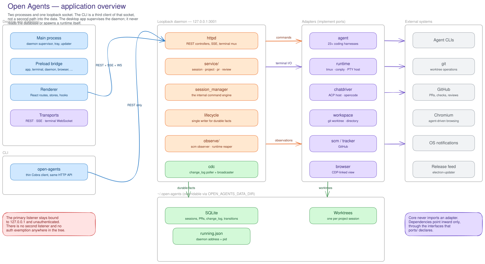
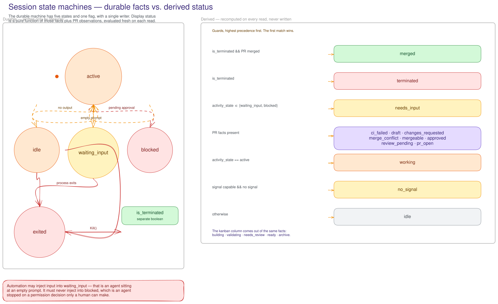
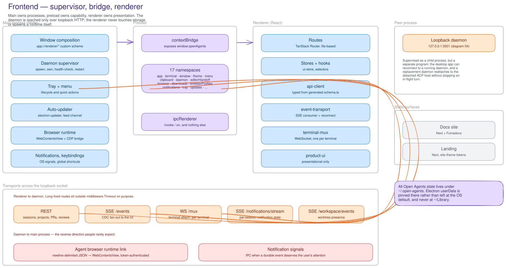
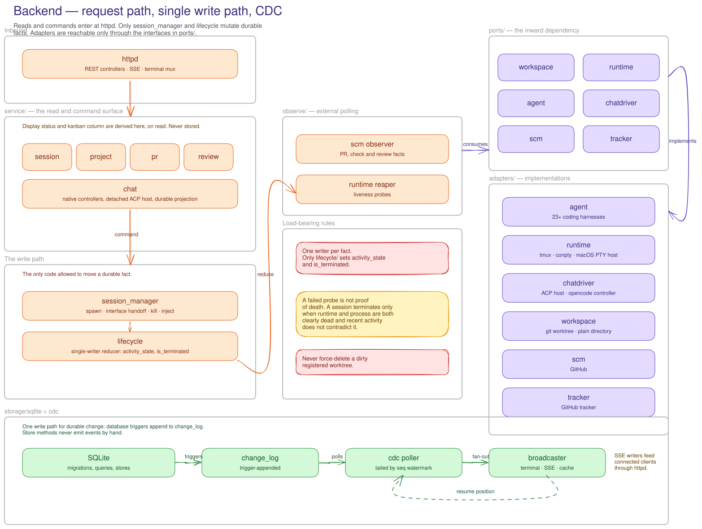
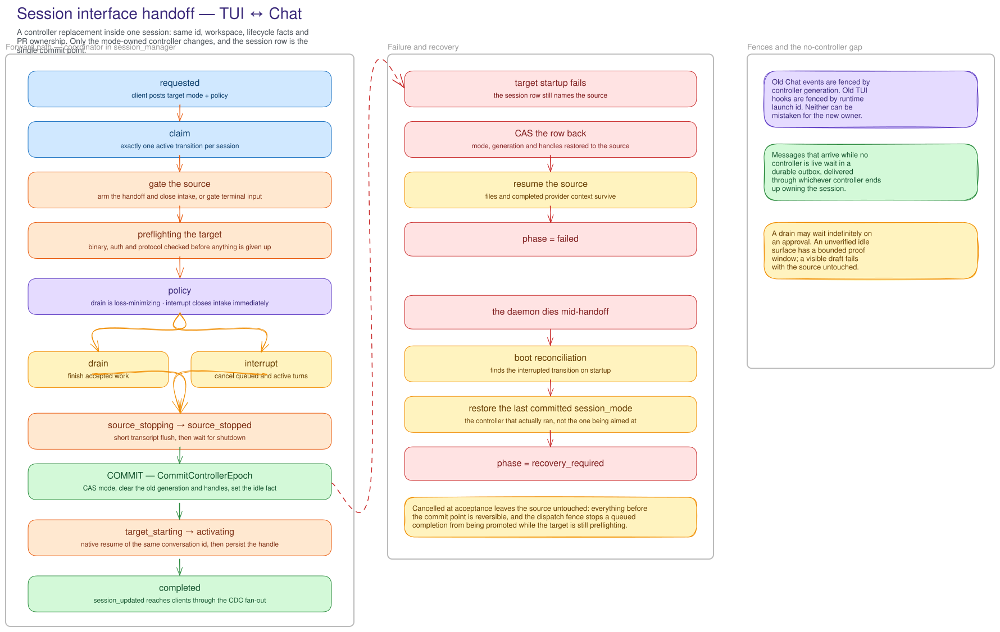

  

### Open Agents

#### Plan, run, and supervise coding agents from one place.

[**Download Open Agents**](#install) &nbsp;&bull;&nbsp; [Documentation](https://orchestrator.inc/docs) &nbsp;&bull;&nbsp; [Releases](https://github.com/sudo-adduser-jordan/open-agents/releases) &nbsp;&bull;&nbsp; [Contributing](CONTRIBUTING.md) &nbsp;&bull;&nbsp; [Discord](https://discord.com/invite/UZv7JjxbwG)

## Install

Download the latest Open Agents desktop app for your platform. Open Agents checks for updates automatically.

| Platform              | Download                                                                                                                      |
| --------------------- | ----------------------------------------------------------------------------------------------------------------------------- |
| macOS (Apple silicon) | [Download](https://github.com/sudo-adduser-jordan/open-agents/releases/latest/download/open-agents-darwin-arm64.dmg)   |
| macOS (Intel)         | [Download](https://github.com/sudo-adduser-jordan/open-agents/releases/latest/download/open-agents-darwin-x64.dmg)     |
| Windows               | [Download](https://github.com/sudo-adduser-jordan/open-agents/releases/latest/download/open-agents-win32-x64.exe)      |
| Linux (AppImage)      | [Download](https://github.com/sudo-adduser-jordan/open-agents/releases/latest/download/open-agents-linux-x64.AppImage) |
| Linux (Debian/Ubuntu) | [Download](https://github.com/sudo-adduser-jordan/open-agents/releases/latest/download/open-agents-linux-x64.deb)      |
| Linux (Fedora/RHEL)   | [Download](https://github.com/sudo-adduser-jordan/open-agents/releases/latest/download/open-agents-linux-x64.rpm)      |

The desktop app runs the daemon for you, so no CLI is required. See the [installation guide](https://orchestrator.inc/docs/installation) for agent CLI setup and troubleshooting.

## Architecture

Five diagrams of how Open Agents is put together. Each is generated from code in `frontend/scripts/diagrams/`, so it can be rebuilt when the architecture moves — see [`docs/assets/diagrams/README.md`](docs/assets/diagrams/README.md). Open any image for a full-size copy, or the `.excalidraw` link to edit it.

### 1. Application overview

Which processes exist, who is allowed to talk to whom, and where state actually lives. Every other diagram is a zoom-in on one of the frames below.

[Open full size](docs/assets/diagrams/01-application-overview.svg) &nbsp;&bull;&nbsp; [Edit in Excalidraw](docs/assets/diagrams/01-application-overview.excalidraw)

### 2. Session state machines

The two machines that are constantly mistaken for one: the durable `activity_state` written by a single reducer, and the derived display status recomputed on every read.

[Open full size](docs/assets/diagrams/02-session-state-machines.svg) &nbsp;&bull;&nbsp; [Edit in Excalidraw](docs/assets/diagrams/02-session-state-machines.excalidraw)

### 3. Frontend

Main owns processes, preload owns capability, renderer owns presentation. Every byte crossing into the renderer goes through the bridge.

[Open full size](docs/assets/diagrams/03-frontend-architecture.svg) &nbsp;&bull;&nbsp; [Edit in Excalidraw](docs/assets/diagrams/03-frontend-architecture.excalidraw)

### 4. Backend

The Go request path, the single write path allowed to move a durable fact, the ports the core depends on, and the CDC pipeline that fans changes back out.

[Open full size](docs/assets/diagrams/04-backend-architecture.svg) &nbsp;&bull;&nbsp; [Edit in Excalidraw](docs/assets/diagrams/04-backend-architecture.excalidraw)

### 5. Session interface handoff

The TUI ↔ Chat handoff as a saga: the session row is the single commit point, everything before it is reversible, and messages that arrive while no controller is live survive whoever ends up owning the session.

[Open full size](docs/assets/diagrams/05-interface-handoff-saga.svg) &nbsp;&bull;&nbsp; [Edit in Excalidraw](docs/assets/diagrams/05-interface-handoff-saga.excalidraw)

For the reasoning behind these boundaries, start with [docs/architecture.md](docs/architecture.md) and [docs/STATUS.md](docs/STATUS.md).

## Screenshots

## License

Open Agents is available under the [Apache License 2.0](LICENSE).
