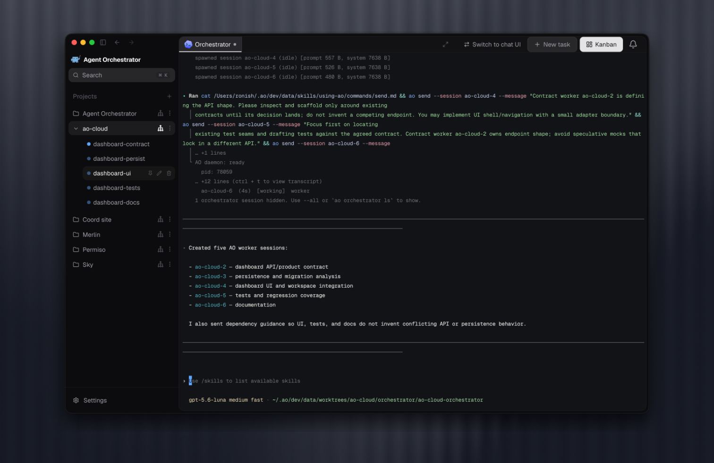

<div align="center">
  

### Open Agents

#### Plan, run, and supervise coding agents from one place.

[](https://github.com/sudo-adduser-jordan/open-agents/stargazers)

[](https://github.com/sudo-adduser-jordan/open-agents/releases/latest)
[](https://github.com/sudo-adduser-jordan/open-agents/releases)
[](LICENSE)
[](https://discord.com/invite/UZv7JjxbwG)

Give every coding task its own agent, workspace, and feedback loop.<br />
Plan and delegate larger outcomes with a project-aware manager.<br />
Follow every worker, pull request, CI run, and review in a live Kanban.

[**Download Open Agents**](#install) &nbsp;&bull;&nbsp; [Documentation](https://orchestrator.inc/docs) &nbsp;&bull;&nbsp; [Releases](https://github.com/sudo-adduser-jordan/open-agents/releases) &nbsp;&bull;&nbsp; [Contributing](CONTRIBUTING.md) &nbsp;&bull;&nbsp; [Discord](https://discord.com/invite/UZv7JjxbwG)

<br />


</div>

## A workspace for agent-driven development

One coding agent can handle a task. Running several across a project creates a different job: deciding what matters, splitting work cleanly, giving each agent the right context, preventing branch collisions, and following every change through review and merge.

Open Agents is a local desktop workspace built for that job. Add a repository and create a worker session with the coding agent, model, and interface that fit the task. For Git-backed work, Open Agents gives the worker its own branch and worktree. The task, conversation, terminal, changed files, browser preview, pull request, CI, and review state stay attached to that session from start to finish.

Behind the desktop app, Open Agents' local daemon watches agent activity and source-control state. The result is a shared, live view of the project instead of a collection of disconnected terminals, branches, and browser tabs.

## Install

Download the latest Open Agents desktop app for your platform. Open Agents checks for updates automatically.

| Platform              | Download                                                                                                                      |
| --------------------- | ----------------------------------------------------------------------------------------------------------------------------- |
| macOS (Apple silicon) | [Download](https://github.com/sudo-adduser-jordan/open-agents/releases/latest/download/open-agents-darwin-arm64.dmg)   |
| macOS (Intel)         | [Download](https://github.com/sudo-adduser-jordan/open-agents/releases/latest/download/open-agents-darwin-x64.dmg)     |
| Windows               | [Download](https://github.com/sudo-adduser-jordan/open-agents/releases/latest/download/open-agents-win32-x64.exe)      |
| Linux (AppImage)      | [Download](https://github.com/sudo-adduser-jordan/open-agents/releases/latest/download/open-agents-linux-x64.AppImage) |
| Linux (Debian/Ubuntu) | [Download](https://github.com/sudo-adduser-jordan/open-agents/releases/latest/download/open-agents-linux-x64.deb)      |
| Linux (Fedora/RHEL)   | [Download](https://github.com/sudo-adduser-jordan/open-agents/releases/latest/download/open-agents-linux-x64.rpm)      |

Launch Open Agents and point it at the repository you want Open Agents to manage. The desktop app runs the daemon for you, so no CLI is required. See the [installation guide](https://orchestrator.inc/docs/installation) for agent CLI setup and troubleshooting.


## Workers execute focused tasks

A worker is Open Agents' unit of execution: one task, one coding agent, and one isolated workspace. Use **New task** when the work is already clear. Describe the outcome, choose an agent and model, attach relevant files, and work with the agent in structured Chat or its native terminal UI.

Open a worker at any time to continue the conversation, attach to its terminal, inspect its changes, use its isolated browser, review its pull request, or send CI and review feedback back to the same agent. This makes each task independently understandable and keeps parallel work from collapsing into one shared context.


## The manager plans across the project

The project manager is Open Agents' persistent planning and coordination agent. It works at the level above individual tasks: the product direction, technical strategy, priorities, and sequence of work across the repository.

Use the manager to explore an idea before implementation, brainstorm product and technical approaches, reason through tradeoffs, identify high-impact work, and turn an ambiguous outcome into a concrete plan. Its project-scoped conversation preserves goals, decisions, constraints, and earlier reasoning. It combines that planning history with repository context and live Open Agents state, including active workers, ownership, pull requests, CI, and reviews. This keeps planning grounded in both the project and the work already underway.

When a plan becomes actionable, the manager can break it into focused tasks, spawn or redirect workers, pass each worker the relevant context, follow their progress, and coordinate follow-up work. The manager owns planning and delegation; workers own implementation, tests, commits, and pull requests.



## The Kanban keeps the system legible

Every worker appears on the same live board, whether you started it from **New task** or the manager delegated it. Open Agents derives each card's position from session, pull request, CI, and review facts, turning the Kanban into an operational view of the project:

- **Working:** workers that are actively implementing or ready for another instruction
- **Needs you:** blocked sessions, missing input, failed CI, requested changes, or lost signals
- **In review:** open and draft pull requests waiting on checks or review
- **Ready to merge:** approved or mergeable work, with merged sessions kept visible until they are archived

Each card keeps the task, agent, branch, activity, pull request, and status together. Open it to inspect the conversation or terminal, changed files, PR summary, reviews, and preview. The board shows what is moving, what is blocked, and where your attention will have the most impact.


## One workflow, from idea to merge

1. **Start at the right level.** Give a clear task directly to a worker, or develop a larger outcome with the project manager and let it shape the plan.
2. **Delegate focused work.** Start workers yourself or have the manager create them with the context and ownership they need.
3. **Build in isolation.** Every Git-backed worker gets its own branch and worktree; standalone agents get Open Agents-managed branchless directories without requiring a project or repository.
4. **Supervise live state.** Open Agents follows agent activity, pull requests, CI, review feedback, and merge conflicts, then reflects those facts on the Kanban.
5. **Close the feedback loop.** Inspect any worker directly, make project-level decisions with the manager, and return actionable failures or review comments to the agent that owns the work.

Open Agents works with the coding agents and source-control workflow you already use. Agents keep their native strengths; Open Agents supplies the project context, isolated execution, coordination, and operational view that make them work as a system.

## Product highlights

<table>
  <tr>
    <td width="36%" valign="middle">
      <h3>Pull requests and agent reviews</h3>
      <p>Keep CI, mergeability, reviewer state, and interactive agent reviews beside the worker, then return requested changes to the same owner.</p>
    </td>
    <td width="64%">
      
    </td>
  </tr>
  <tr>
    <td width="36%" valign="middle">
      <h3>Agent-controllable browser</h3>
      <p>Preview and inspect a worker's local app beside its interface. Browser profiles are isolated per worker so parallel UI tasks do not share state.</p>
    </td>
    <td width="64%">
      
    </td>
  </tr>
  <tr>
    <td width="36%" valign="middle">
      <h3>Native interfaces, one supervisor</h3>
      <p>Use structured Chat or the agent's native terminal UI while Open Agents keeps task context, workspace state, and feedback in one place.</p>
    </td>
    <td width="64%">
      
    </td>
  </tr>
</table>

## Supported agents

**opencode** supported through one supervised workflow.

<table>
  <tr valign="middle">
    <td valign="middle" nowrap> &nbsp; <b>opencode</b></td>
  </tr>
</table>

**Use the interface that fits the moment: structured Chat or the agent's native terminal UI.**

## Report a bug

[Open a bug report](https://github.com/sudo-adduser-jordan/open-agents/issues/new?template=bug_report.yml) from your own GitHub account. A few sentences in your own words about what you did and what went wrong are enough. Add what you expected, reproduction steps, your Open Agents version and OS, or a screenshot if you have them; these are helpful, not prerequisites.

A local coding agent can help you clarify the report and gather evidence using the [bug-triage skill](.agents/skills/bug-triage/SKILL.md). Keep the issue body focused on your observations, with agent-collected logs, database excerpts, and investigation notes in separate attachments. Review any draft before submitting it under your own account. Please don't ask an automated bot to file issues on your behalf; reporter attribution matters.

For help describing a problem, join the [bug-triaging channel on Discord](https://discord.com/channels/1476302178913357958/1491735678156013588). See [contribution guidance](CONTRIBUTING.md#bugs-and-features) for more detail.

## Develop and contribute

Contributions are welcome across code, docs, triage, examples, and tests.

```bash
git clone https://github.com/sudo-adduser-jordan/open-agents.git
cd open-agents
```

Start with the [development guide](docs/development.md) for prerequisites, local setup, and test commands. Read [CONTRIBUTING.md](CONTRIBUTING.md) before opening a pull request, and use [GitHub Issues](https://github.com/sudo-adduser-jordan/open-agents/issues) for bugs and feature requests.

## Documentation

| Document                                                         | Start here when you need                                                                     |
| ---------------------------------------------------------------- | -------------------------------------------------------------------------------------------- |
| [Product documentation](https://orchestrator.inc/docs)                  | Installation, agent setup, and day-to-day product usage.                                     |
| [docs/documentation-map.md](docs/documentation-map.md)           | Which docs are human-facing, which are machine-readable contracts, and which wins on drift.  |
| [docs/architecture.md](docs/architecture.md)                     | Backend mental model, lifecycle, persistence, CDC, status derivation, and daemon boundaries. |
| [docs/backend-code-structure.md](docs/backend-code-structure.md) | Package ownership and where each backend concern belongs.                                    |
| [docs/cli/README.md](docs/cli/README.md)                         | CLI behavior and daemon route mapping.                                                       |
| [docs/development.md](docs/development.md)                       | Prerequisites, build steps, running tests, and troubleshooting for local development.        |
| [docs/STATUS.md](docs/STATUS.md)                                 | What currently ships on `main` and what remains in flight.                                   |

## Community

Join [Discord](https://discord.com/invite/UZv7JjxbwG) for help and contributor discussion, or start a conversation in [GitHub Issues](https://github.com/sudo-adduser-jordan/open-agents/issues).

## License

Open Agents is available under the [Apache License 2.0](LICENSE).
