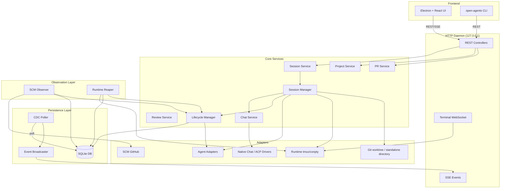
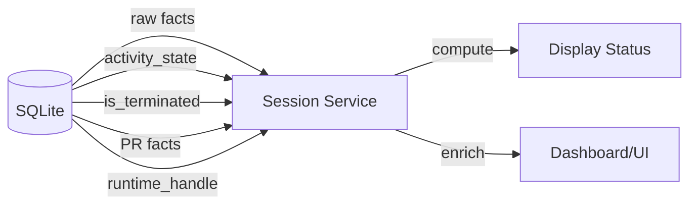
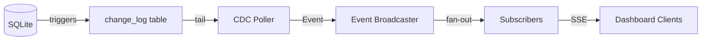
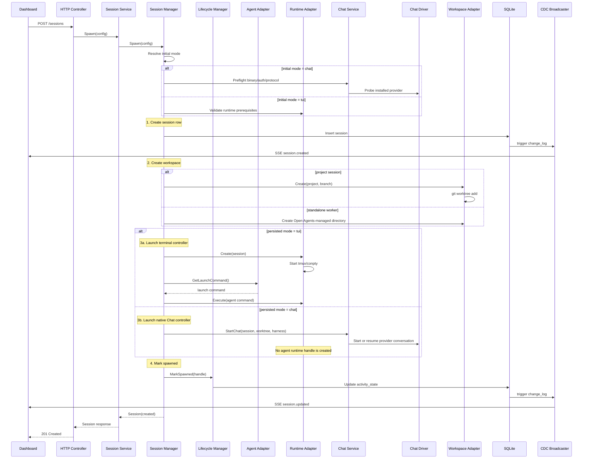
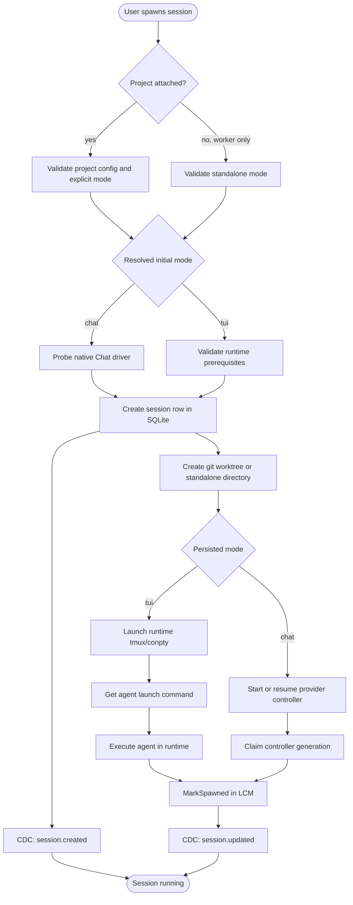
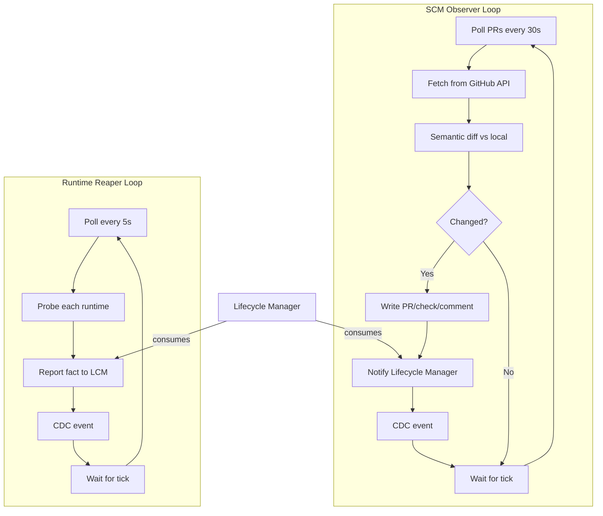
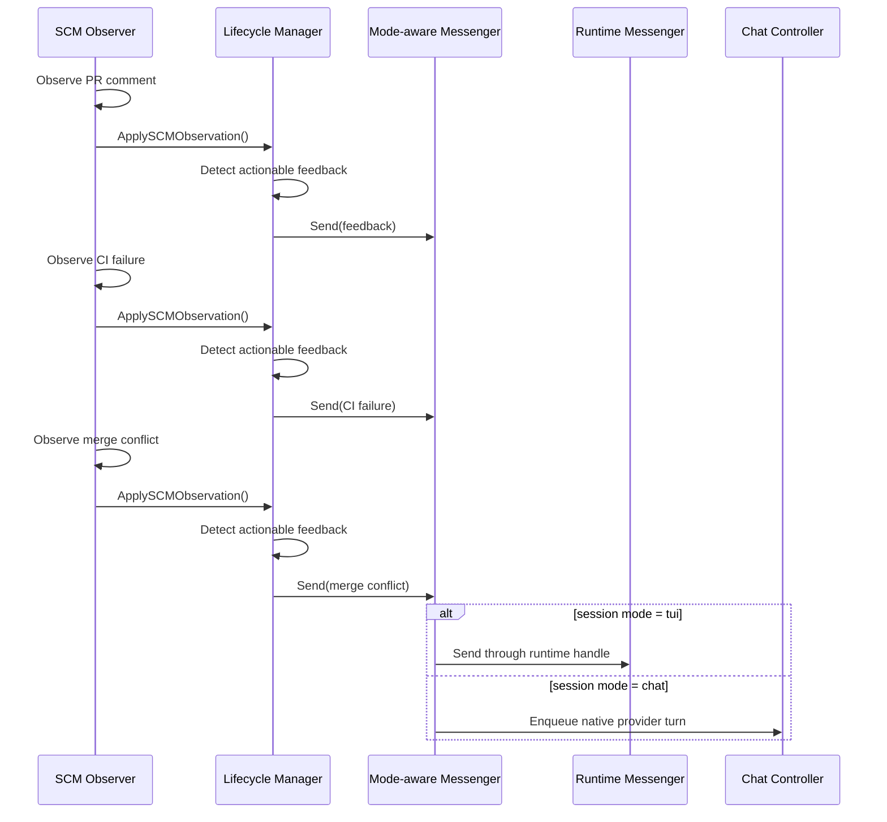

# Open Agents Architecture

Open Agents is a long-running Go daemon that supervises multiple parallel AI coding agent sessions. Project sessions own isolated git worktrees; projectless standalone workers own Open Agents-managed plain-directory workspaces. Every session commits to one interface mode at a time. A TUI session runs its agent inside a tmux/conpty runtime; a Chat session runs a native protocol controller without an agent terminal runtime. The opencode Chat controller lives in a detached per-session host so daemon/desktop replacement reconnects without stopping an in-flight turn. The ACP host additionally preserves connection setup, JSON-RPC correlation, pending interactions, and acknowledged prompt replay while the replacement daemon rebuilds its typed controller. A durable handoff may move a compatible native conversation between TUI and Chat, but both controllers are never live at once. The daemon coordinates both through the same session, lifecycle, workspace, storage, and observation boundaries.

## Table of Contents

- [Mental Model](#mental-model)
- [System Overview](#system-overview)
- [Core Architectural Principles](#core-architectural-principles)
- [Component Architecture](#component-architecture)
- [Data Flows](#data-flows)
- [Split leaves](#split-leaves-single-source-of-truth-per-concern)

---

## Mental Model (canonical: [overview.md](../overview.md))

Three-stage pipeline OBSERVE → UPDATE → DERIVE; display status is never stored. Full fact list and load-bearing rules live in [overview.md](../overview.md) — do not duplicate them here.

---

## System Overview



---

## Core Architectural Principles

### 1. Port-Based Design

Core code never depends on concrete implementations. All external systems are accessed through port interfaces defined in `backend/internal/ports/`:

```mermaid
graph LR
    Core[Core Services] -->|consumes| Ports[Port Interfaces]
    Adapters[Adapters] -->|implement| Ports
    External[External Systems] -->|wrapped by| Adapters

```



### 2. Durable Facts, Derived Status

Storage layer persists minimal facts. Service layer computes display status on-demand:



### 3. Observer Pattern

Observation is separated from action:

- **Observe layer** — SCM Observer, Runtime Reaper poll external state
- **Lifecycle layer** — Reduces observations into durable facts
- **Service layer** — Computes display status from facts

### 4. Change Data Capture

All durable changes flow through a CDC pipeline:



---

## Component Architecture

### Package Layout

```
backend/internal/
├── domain/              # Shared vocabulary and durable fact records
├── ports/               # Inbound/outbound interfaces
├── service/             # Controller-facing services
│   ├── project/         # Project CRUD
│   ├── session/         # Session read-model assembly
│   ├── chat/            # Chat controllers, persistent provider hosts + durable projection
│   ├── pr/              # PR observation service
│   └── review/          # Code review service
├── session_manager/     # Internal session command engine
├── lifecycle/           # Durable session fact reducer
├── observe/             # Observation loops
│   ├── scm/             # SCM (GitHub) observer
│   └── reaper/          # Runtime liveness observer
├── storage/             # SQLite persistence
│   └── sqlite/          # DB, migrations, queries, stores
├── cdc/                 # Change-log poller and broadcaster
├── httpd/               # HTTP API, controllers, terminal mux
├── terminal/            # Terminal session protocol
├── adapters/            # Concrete adapter implementations
│   ├── agent/           # 23+ agent harnesses
│   ├── chatdriver/      # Native provider protocols and reusable ACP transport
│   ├── runtime/         # tmux/conpty runtimes
│   ├── workspace/       # git worktree and standalone-directory adapters
│   ├── scm/             # GitHub
│   └── tracker/         # GitHub tracker
├── daemon/              # Production wiring
└── config/              # Environment-based configuration
```

### Core Data Flow



---

## Data Flows

### Session Spawn Flow



### Session Interface Handoff

An interface switch is a controller replacement inside the existing Open Agents session,
not a new session. The session id, optional project, workspace, lifecycle facts,
and provider-native conversation id stay the same. For project sessions, branch
and PR ownership also stay the same. Only the mode-owned controller changes.

The generic coordinator lives in `session_manager`; providers opt in through the
small `AgentInterfaceHandoff` capability only after their TUI resume id and Chat
protocol id are proven to name the same native conversation. The shipped
opencode harness currently satisfies that contract. Merely having a Chat/ACP driver is not
enough to enable switching for another harness.

The native ID handed over is the current Terminal conversation, which can differ
from the last Chat provider (for example after replacing a manager). This
does not prove that the new provider inherited the old context. Session Manager
reserves a `ChatProviderHandoff` only from a matching durable TUI→Chat transition;
ordinary resumes retain the exact-handle check. Chat resumes the verified target,
reconciles only its provider scope, and prepares a visible context boundary.
Lifecycle and SQLite atomically publish that boundary, native history, controller
generation, and any project-narrative ownership transfer, checking the observed
owner, head, sequence, and controller fence again after provider I/O. Prior rows
remain intact, but are not represented as context inherited by the new provider.
Ordinary Terminal restore retains its fresh-start fallback when native history is
unavailable, including rollback and crash recovery. Prior Chat rows remain intact;
returning with a new native identity publishes a separate context boundary rather
than claiming continuity. A Terminal→Chat handoff still requires native replay and
never silently substitutes a fresh Chat provider.

The native-history barrier combines trusted native checkpoints with the
latest completed Open Agents turn in the active provider scope. A newer completed turn can
supersede a legacy hook fact tied to an older settled turn; otherwise a Chat answer followed by an
immediate round trip would keep waiting for the older Terminal answer to be last.
Hook timestamps must prove the fact predates the superseding turn; repeated text
alone is not evidence. A hook newer than the durable completion requires settled
replay after that high-water turn. Unknown hook facts still gate replay. Hook
observation time also orders native identities within a launch, so delayed hooks
cannot replace the current identity's facts.

Independent handoff publication settles the retired predecessor's work and fails
pending requests in the same transaction as history and ownership. The native
driver scopes projection IDs at the adapter boundary and decodes them for native
RPCs. A durable
branch flag preserves legacy unscoped IDs on upgrade; native forks inherit
that flag, while new provider boundaries use scoped IDs.
When native fork ancestry is proven, replay omits copied prefixes only if their stable
item IDs and complete content match retained ancestor rows. Those rows stay in
their original scope. Unknown ancestry or changed content is retained in full.

```mermaid
sequenceDiagram
    participant Client
    participant Manager as Session Manager
    participant Lifecycle as Lifecycle Manager
    participant DB as SQLite
    participant Source as Current Controller
    participant Target as Target Controller

    Client->>Manager: POST interface-transition(target, policy)
    Manager->>DB: Claim one active transition
    alt source = Chat
        Manager->>Source: Arm handoff; close intake and queue dispatch
    else source = TUI
        Manager->>Source: Gate new terminal input
    end
    Manager->>Target: Preflight binary/auth/protocol
    alt policy = drain
        Manager->>Source: Finish accepted work
    else policy = interrupt
        Source->>DB: Cancel queued Chat turns
        Manager->>Source: Cancel active provider turn
    end
    Manager->>Source: Stop and wait for shutdown
    Manager->>Lifecycle: CommitControllerEpoch(source, target, native id)
    Lifecycle->>DB: CAS mode + clear old generation/handles + idle fact
    Manager->>Target: Native resume(same conversation id)
    Manager->>DB: Persist new handle/generation; complete transition
    DB-->>Client: session_updated CDC invalidation
```

The session row is the commit point. If target startup fails, the coordinator
CASes the row back and resumes the source. If the daemon dies mid-handoff, boot
reconciliation marks the interrupted transition for recovery and restores the
controller named by the last committed `session_mode`. Lifecycle/automation
messages received during the no-controller gap are held in a durable outbox and
delivered through whichever controller ultimately owns the session. Terminal
transition paths, transient delivery failures, and daemon restarts all retain
the message for retry; Chat retries carry a stable idempotency key. Old Chat
events are fenced by controller generation; old TUI hooks are fenced by runtime
launch id.

`drain` is loss-minimizing and may wait on an approval or user-input request;
`interrupt` synchronously closes source intake and queue dispatch at transition
acceptance. After target preflight succeeds, it settles queued Chat turns and
then sends the provider's active-turn cancellation, allows a short transcript
flush, and stops the source. The reversible first phase preserves queued work if
the target is unavailable; its dispatch fence prevents a completion callback
from promoting that work during preflight or provider cancellation. Files and
completed provider context survive.
There is no provider-neutral way to migrate a currently executing tool call or a
detached background process, and Open Agents does not synthesize terminal screen output
into structured Chat history.

For TUI drains, Open Agents gates new terminal input before checking quiescence. Agent
adapters that can interpret their rendered TUI report work state and composer
occupancy as separate ephemeral facts. The runtime side of that contract must
provide the current rendered viewport with ANSI cell styles: tmux uses styled
`capture-pane`, while macOS and Windows detached PTY hosts maintain a VT cell
model beside their historical replay ring. Open Agents accepts only repeated observations
of an idle surface with an empty composer, held across the settle window; a
visible draft fails with the source untouched and requires the user to submit,
clear, or explicitly discard it. Adapter/runtime pairs without rendered-surface
support retain the causally newer idle-fact or legacy terminal-idle fallback. An
unverified idle state has a bounded proof window; active work or a user-paced
decision remains unbounded.

### Observation Flow



### Feedback Routing Flow



---

## Split leaves (single source of truth per concern)

This file keeps the system overview, principles, component layout, and data flows. Detail lives in leaves — do not duplicate it here:

- Mental model and load-bearing rules: [overview.md](../overview.md)
- Package ownership and import graph: [packages.md](packages.md)
- SQLite schema and CDC pipeline: [storage-cdc.md](storage-cdc.md)
- Status derivation and lifecycle: [lifecycle-status.md](lifecycle-status.md)
- SCM polling detail: [scm-observer.md](scm-observer.md)
- Loopback HTTP, terminal mux, browser bridge: [http-terminal.md](../interfaces/http-terminal.md)
- Thin CLI: [cli.md](../interfaces/cli.md)
- Renderer design system: [design-system.md](../frontend/design-system.md)

## Summary

Open Agents's architecture is designed around:

- **Separation of concerns** — Observation, persistence, and display are distinct layers
- **Port-based design** — Core code depends on interfaces, not implementations
- **Durable minimalism** — Store only facts, compute everything else
- **Event-driven updates** — CDC broadcasts changes to all subscribers
- **Isolation** — Each project session owns a git worktree, each standalone worker owns an Open Agents-managed directory, and every session has exactly one live mode-specific controller, including across handoffs
- **Safety** — Conservative termination, path validation, gitignored hooks

This architecture enables parallel AI agents to work safely while maintaining complete visibility and control.
