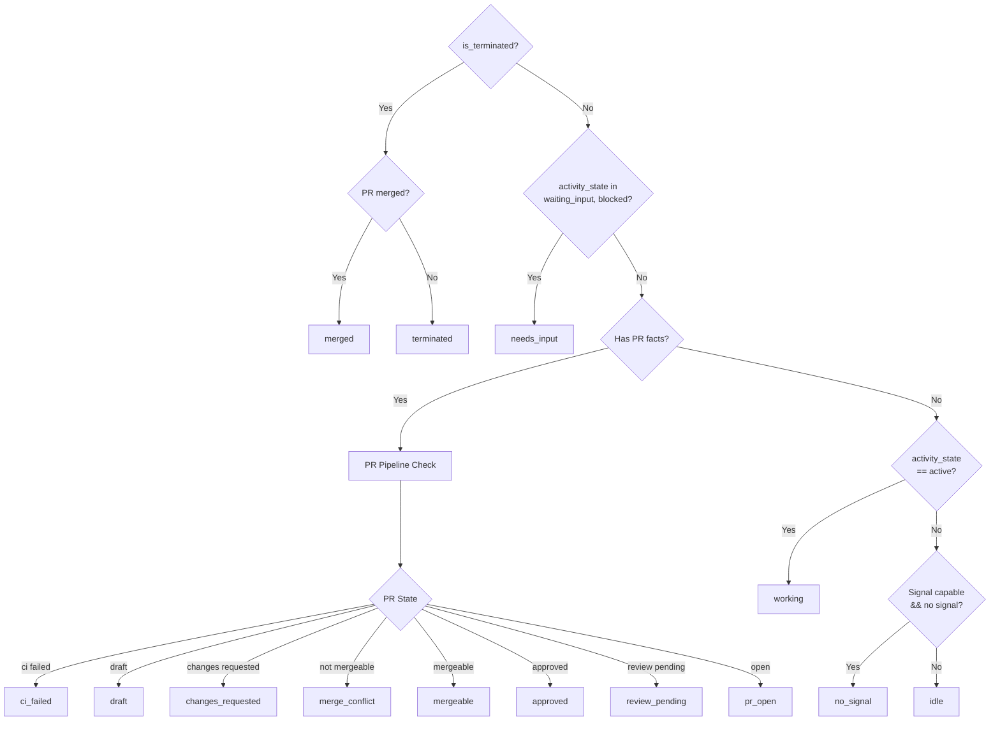
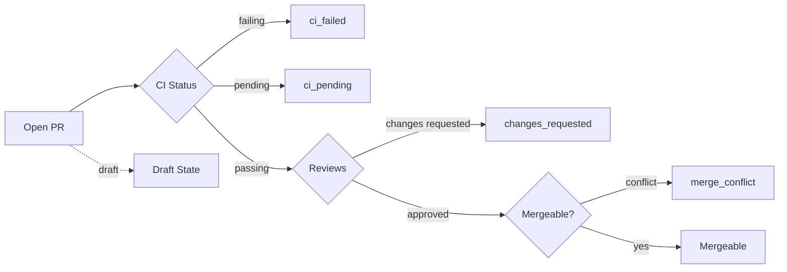
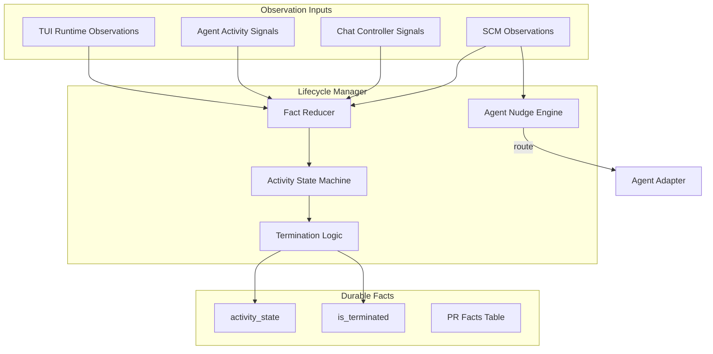
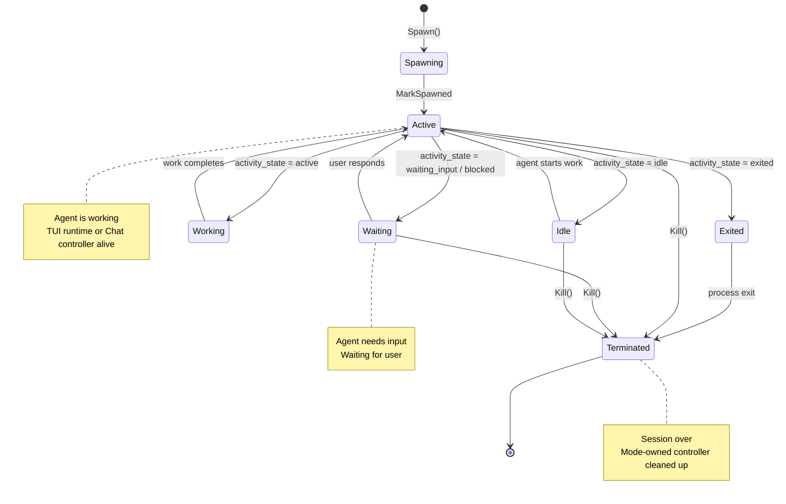
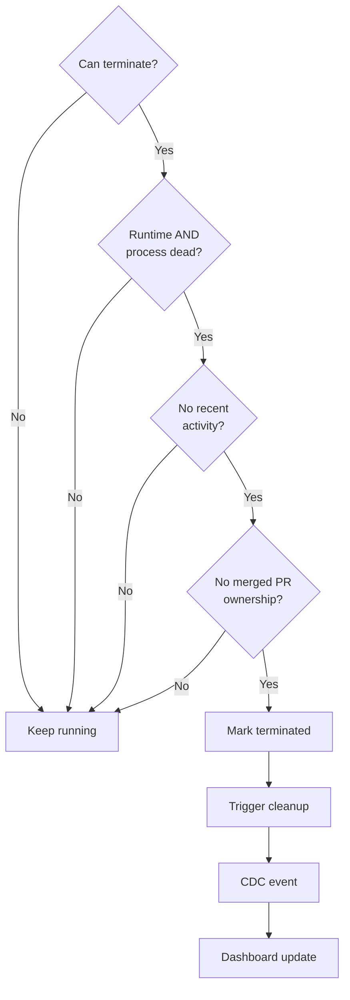

# Lifecycle and status derivation

Display status is derived at read time by the service layer. Durable facts are the only persisted session state — see [overview.md](../overview.md).

## Status Derivation

### Display Status Precedence

The `service.Session` computes display status from durable facts using this precedence (highest to lowest):

### PR Pipeline States

---

## Lifecycle Management

### Lifecycle Manager Responsibilities

The `lifecycle.Manager` is the **canonical write path** for all session lifecycle facts:

### Session State Machine

### Termination Guardrails

The lifecycle manager only terminates when **all** conditions are met:

**Key principle:** Failed probes are NOT proof of death. A session is only terminated when the runtime and process are **both** clearly dead and recent activity doesn't contradict that.

---

## Sources of truth

- Reducer: `backend/internal/lifecycle/`
- Read model: `backend/internal/service/session/`
- Observation inputs: [architecture.md](architecture.md), [scm-observer.md](scm-observer.md)
