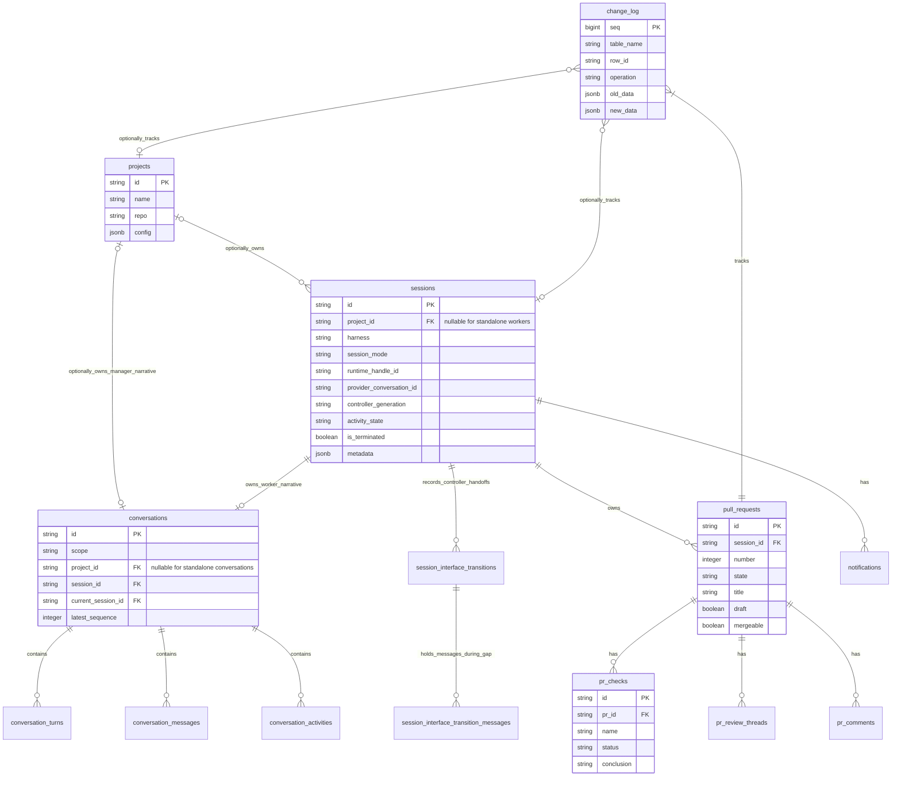
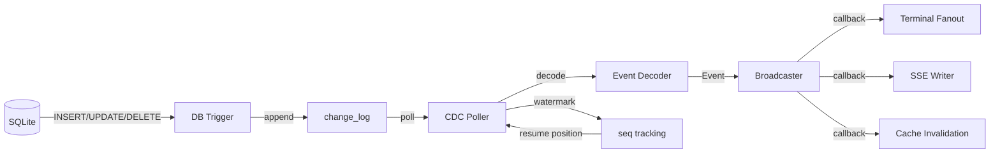

# Storage and CDC

Durable facts, SQLite schema, and the change-data-capture pipeline. Canonical contract: [overview.md](../overview.md).

## Persistence and CDC

### SQLite Schema

### CDC Pipeline

---

## Sources of truth

- Migrations and queries: `backend/internal/storage/sqlite/migrations/`, `backend/internal/storage/sqlite/queries/`
- Generated code: `backend/internal/storage/sqlite/gen/` (via `task db:sqlc`; never hand-edit)
