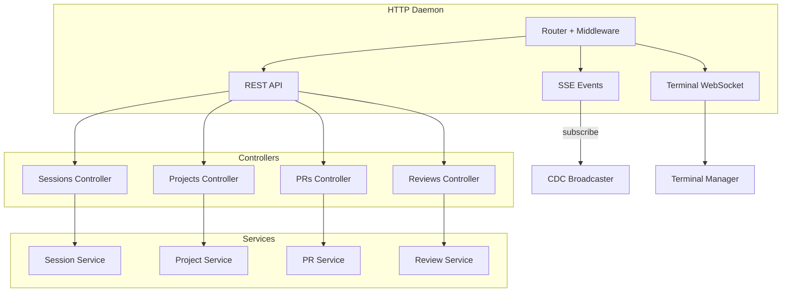
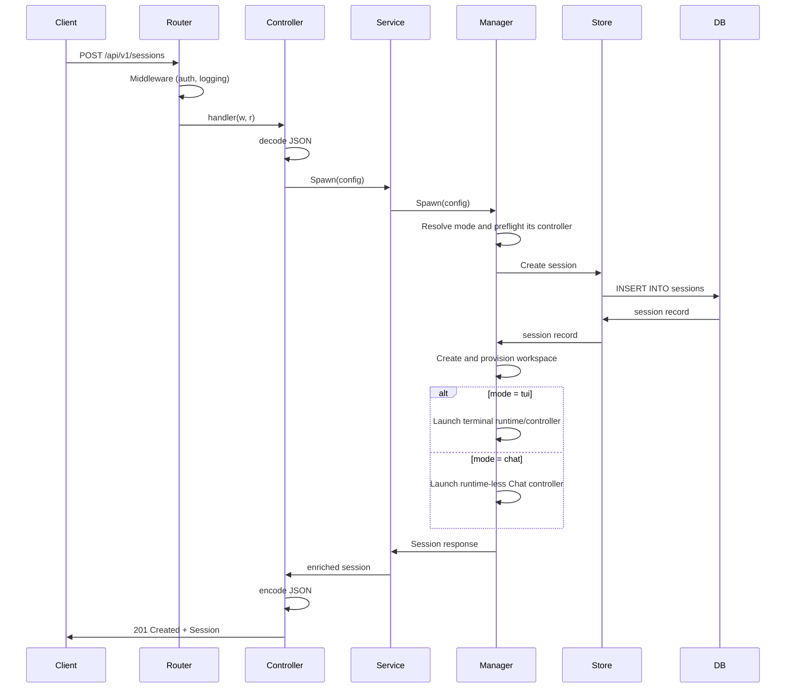
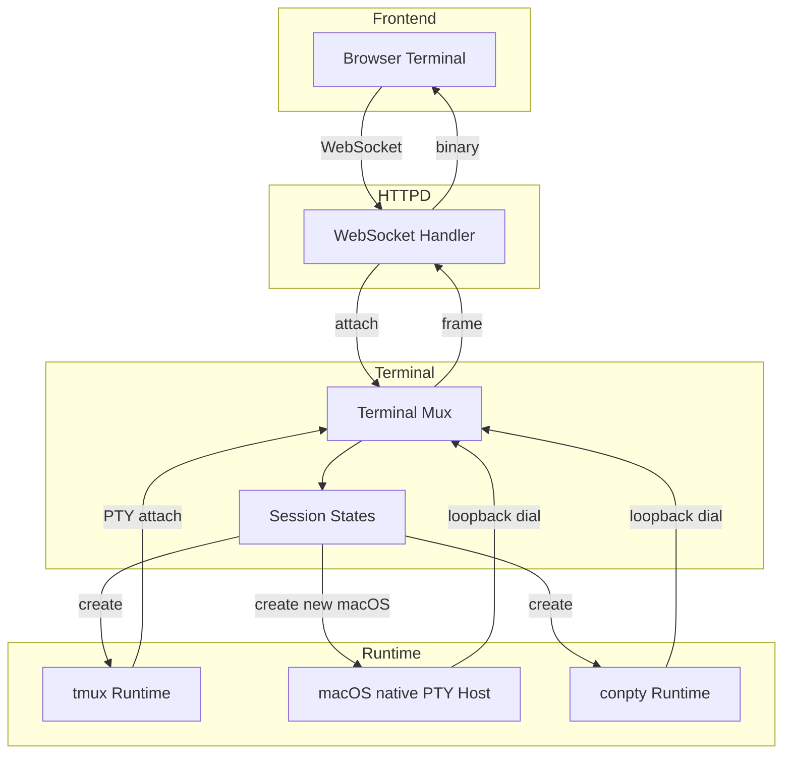
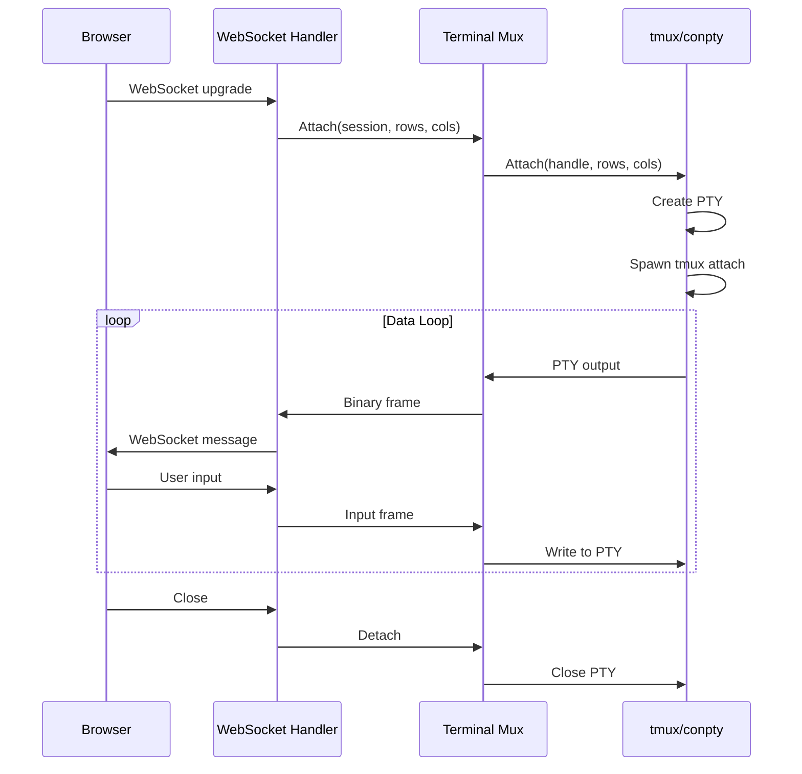

# HTTP, terminal, and browser bridge

Loopback-only daemon surface, terminal multiplexing, and the Electron browser bridge.

## HTTP Layer

### API Structure

### HTTP Listener Architecture

The daemon runs one HTTP listener: the primary loopback listener binds `127.0.0.1:3001` with no authentication and serves the desktop app and CLI. No additional network-facing listener is supported.

### Request Flow

---

## Terminal Multiplexing

The mux is the primary agent controller only for TUI-mode sessions. Chat-mode
sessions have no agent runtime handle and never attach their provider through
tmux. They may still open session-scoped shell terminals as a worktree escape
hatch; those shells are separate resources and do not become the agent
controller.

### Terminal Architecture

### Attach Flow

## Browser Runtime Bridge

Browser automation uses a dedicated local socket (`browser.sock` on Unix,
`open-agents-browser[-dev]` named pipe on Windows) between the daemon and Electron. The
daemon owns command authorization/correlation; Electron owns the actual browser
targets. Commands never use the supervisor liveness socket and never enable an
unauthenticated remote-debugging port.

Electron attaches its debugger directly to the selected session's
`WebContentsView`, so the protocol transport cannot enumerate or attach to the
Open Agents renderer or a different session. Browser control remains on the
loopback daemon surface.

Request observation is an explicit, temporary browser command rather than a
standing debugger feature. Capture is off by default, bound to the active tab
that starts it, limited to 200 in-memory metadata entries, and automatically
expires within at most five minutes. Open Agents never requests or stores request or
response bodies; it allowlists safe headers and redacts URL credentials,
fragments, and query values. Closing the tab, ending the session, or shutting
down Electron disables and discards the capture.

---

## Sources of truth

- Routes and DTOs: `backend/internal/httpd/controllers/dto.go` + `backend/internal/httpd/apispec/specgen/build.go` (via `task api`)
- Spec: `backend/internal/httpd/apispec/openapi.yaml`; typed client: `frontend/src/api/schema.ts`
- CLI mirror: [interfaces/cli.md](cli.md) (hand-mirrored DTOs are a deliberate manual boundary)
