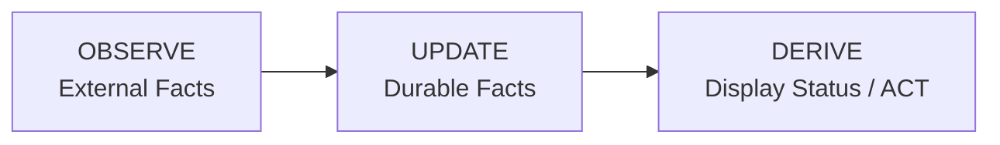

# Overview — Open Agents mental model

Single canonical copy of the durable-vs-derived contract. All other docs link here; do not restate the precedence table elsewhere.

## Mental Model

The fundamental architecture follows a simple three-stage pipeline:

**Key insight:** Display status is never stored. It is computed at read time from durable facts.

### Durable Session Facts

The only persistent session state is:

- `activity_state` — What the agent last reported (`active`, `idle`, `waiting_input`, `blocked`, `exited`). `waiting_input` is an agent at an empty prompt awaiting its next instruction; `blocked` is an agent stopped on a pending permission/approval decision — automation must never inject input into a blocked session.
- `is_terminated` — Whether the session should be treated as over
- `session_mode` plus its runtime/provider handle and generation — The currently committed controller epoch
- `session_interface_transitions` — Durable checkpoints for an in-progress or completed TUI↔Chat handoff
- PR facts — `pr`, `pr_checks`, `pr_comment` tables

### What is NOT Durable

Display status like `working`, `needs_input`, `ci_failed`, `mergeable` are **computed at read time** by the service layer from the durable facts above.

---

## Load-bearing rules

## Load-Bearing Rules

These rules are **load-bearing** — changing them breaks fundamental architectural assumptions:

1. **Never store display status** — Status is derived from durable facts at read time
2. **Never treat failed probes as death** — A failed probe is a fact, not a termination signal
3. **Never force-delete dirty worktrees** — User data safety over cleanup convenience
4. **All app state under ~/.open-agents** — No OS-default app-data locations
5. **Daemon binds to 127.0.0.1 only** — No network exposure, ever
6. **CLI is thin** — All logic lives in the daemon, CLI is just an HTTP client
7. **CDC is source-truth for events** — DB triggers write to change_log, poller fans out
8. **Adapters are leaves** — Adapters never import core packages, only ports and domain
9. **Hooks are gitignored** — Every file an adapter writes must be in .gitignore
10. **Migrations never change** — Add new migrations, never modify existing ones

---

## Where to go next

- Backend system and flows: [backend/architecture.md](backend/architecture.md)
- Package ownership: [backend/packages.md](backend/packages.md)
- Storage and CDC: [backend/storage-cdc.md](backend/storage-cdc.md)
- Status and lifecycle: [backend/lifecycle-status.md](backend/lifecycle-status.md)
- CLI: [interfaces/cli.md](interfaces/cli.md)
- HTTP, terminal, browser: [interfaces/http-terminal.md](interfaces/http-terminal.md)
- Renderer design system: [frontend/design-system.md](frontend/design-system.md)
- Operations: [operations/status.md](operations/status.md), [operations/stack.md](operations/stack.md), [operations/development.md](operations/development.md)
